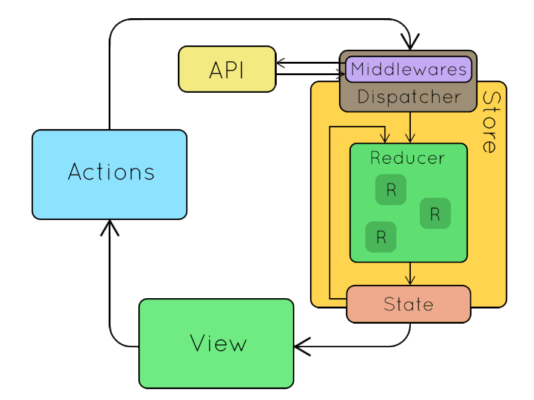

# Redux

## What is Redux

Redux เป็น**รูปแบบ** และ library สำหรับ**จัดการ และ update application states ด้วย events ที่เรียกว่า "actions"** และมี **store กลาง** สำหรับเอาไว้เก็บ state ที่จะต้องใช้ทั่วไปในหลาย ๆ components จุดสำคัญคือ**เราสามารถบอกได้แน่ชัดว่า states ใน app ของเรา update ยังไงบ้าง**

 
 

## Why Redux

Redux **ช่วยเราจัดการ Global States ทำให้เรามองออกว่า States ใน Application ของเราเปลี่ยนแปลงอย่างไร เมื่อไหร่ ทำไม และ ที่ไหน**

 
 

## When Should Use Redux

เราจะใช้ Redux ก็ต่อเมื่อ

- เรามี app states เยอะมาก ๆ ที่เราจะใช้ในหลาย ๆ components ใน app เรา
- app states เปลี่ยนแปลงตลอดเวลา
- logic ในการ update states ซับซ้อน
- app ของเรามีขนาดกลางไปจนถึงใหญ่มาก ๆ และทำงานกันหลายคน
- ถ้าเราอยากเห็นภาพให้ชัด ๆ ว่า states ของเราเปลี่ยนแปลงอย่างไร เมื่อไหร่ ทำไม และที่ไหน
- เราต้องการความสามารถในการจัดการ side effects, การทำ data persistence, data serialization

 
 

## How Redux Works

_Reference: https://dev.to/oahehc/redux-data-flow-and-react-component-life-cycle-11n_

- Views คือ App UI ของเรา ที่สามารถจะเกิด **"actions"** (หรือ events) อะไรบางอย่างได้ **actions จะถูก dispatch (ส่ง)** ไปที่ store
- ก่อนเข้า Store จะผ่าน Middlewares
- จากนั้น actions จะวิ่งเข้า reducer เพื่อที่จะไปเปลี่ยนแปลง states ตาม actions ที่เกิดขึ้น
- เมื่อ states update components ที่คอย subscribe states นั้น ๆ อยู่จะทำการ update ตัวเอง

 
 

## Context API VS Redux

ในการพัฒนา React App มักมีคำถามเกี่ยวกับ Context API และ Redux ว่าสองตัวนี้มันใช้แทนกันได้มั้ย คือสิ่งเดียวกันไหม​ ? Context คือ State management tool รึเปล่า ? มี Context แล้วก็ใช้ Context ตลอดไปเลยสิ ? หรือว่าถ้ามันใช้แทนกันไม่ได้ แล้วเมื่อไหร่เราจะใช้ Context เมื่อไหร่เราจะใช้ Redux เรามาลองดุกันทีละหัวข้อ

- Context และ Redux **ไม่ใช่สิ่งเดียวกัน**

- Context ไม่ใช่ State Management Tool Context เป็นการส่ง values จากที่นึงไปยังอีกที่นึงโดยที่ไม่ต้องส่ง values เหล่านั้น ผ่าน Component ไปเรื่อย ๆ ทีละชั้น ๆ **State Management Tool จริง ๆ แล้วคือ useState และ useReducer**

- Context combo กับ useReducer แทน Redux ไม่ได้มันมีการทำงานบางส่วนคล้ายกัน แต่มันก็มีความสามารถที่แตกต่างกันอยู่ประมาณนึง

- เมื่อไหร่เราควรใช้ Context + useReducer ? เราควรใช้เมื่อเราต้องการจัดการ states ที่ซับซ้อนในบางส่วนของ application ของเรา

- เมื่อไหร่เราควรใช้ Redux ?
  - เรามี app states เยอะมาก ๆ ที่เราจะใช้ในหลาย ๆ components ใน app เรา
  - app states เปลี่ยนแปลงตลอดเวลา
  - logic ในการ update states ซับซ้อน
  - app ของเรามีขนาดกลางไปจนถึงใหญ่มาก ๆ และทำงานกันหลายคน
  - ถ้าเราอยากเห็นภาพให้ชัด ๆ ว่า states ของเราเปลี่ยนแปลงอย่างไร เมื่อไหร่ ทำไม และที่ไหน
  - เราต้องการความสามารถในการจัดการ side effects, การทำ data persistence, data serialization
